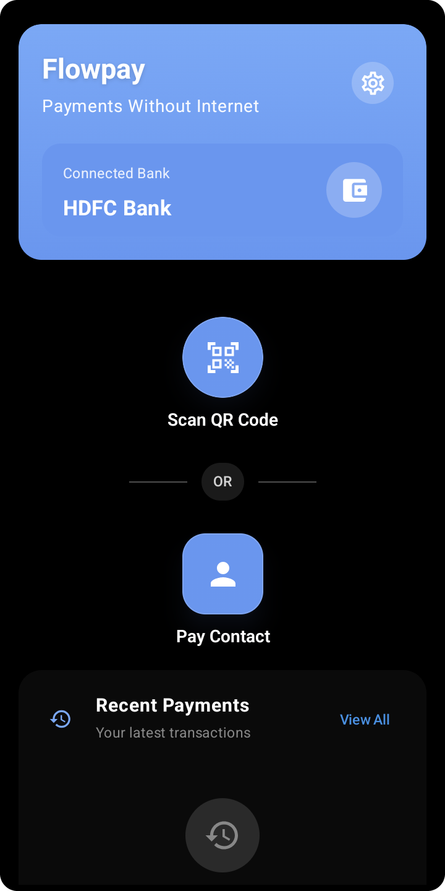

# Tosse Pay - Payments Without Internet

*An Android app that brings UPI payments to users with no internet, using `*99#` USSD and UPI 123Pay (IVR) rails.*


Tosse Pay tackles a problem millions of people in India hit every day: UPI payments break the moment the internet drops. It puts a clean, smartphone-native UI on top of the offline payment rails — `*99#` USSD and UPI 123Pay — that already ship on every Indian phone but stay buried behind menus almost nobody uses.

<p align="center">
  
</p>

---

## What it does

Tosse Pay wraps the two offline UPI rails that already exist on every Indian smartphone but are buried behind UX so poor that almost nobody uses them:

- **`*99#` USSD flow** — dial the shortcode, navigate the menu, send money. Tosse Pay places the call and gives the user a payment UI to start from.
- **UPI 123Pay IVR flow** — the call-based payment flow NPCI launched in 2022 for feature phones. Tosse Pay builds and validates the DTMF payload, places the call, tracks call state throughout, and keeps an on-screen guide in front of the user for the duration.

Each entry point uses the rail that fits it:

- **Scan QR** → dials `*99*1*3#`, the USSD scan-to-pay branch.
- **Pay Contact** (manual entry) → places a **UPI 123Pay IVR call** to NPCI's published service number, with the payee and amount carried as DTMF.

### Why both rails

`*99#` USSD does not work on Jio. USSD rides the legacy GSM signalling channel, and Jio is an all-IP (VoLTE) network that never carried it — which is precisely the gap NPCI built UPI 123Pay to close.

So Tosse Pay ships both. Jio users get the full offline payment experience through the 123Pay IVR rail, with nothing removed and no feature compromise; the USSD rail serves the operators where it does work. Using two rails instead of one is what makes "payments without internet" true for every Indian SIM rather than most of them.

Both rails work without internet. Both are usable today on any Indian SIM with any UPI-linked bank account. No registration with Tosse Pay, no server, no account creation.

**Tosse Pay uses no accessibility service** — it cannot read your screen or any other app. It never sees your UPI PIN, which is entered directly into your bank's IVR/dialer flow; the app only triggers the dialer and reads bank-confirmation SMS locally on the device.

## Prerequisites

To actually run a transaction end-to-end you need:

- An Android device running **Android 10 (API 29)** or higher
- An **Indian SIM** in slot 1 (with dual-SIM support optional)
- A **bank account linked to UPI** via the standard issuer process — same as any UPI app

## Why it was built

The starting question was simple: why do UPI payments fail in low-signal areas, and why does the smartphone UX collapse the moment internet drops out?

The official failure metrics — the publicly reported ~0.7–0.8% technical decline rate — count only transactions that reached a switch and got rejected. They don't count the much larger population: transactions that never initiated because the app couldn't reach the network. That invisible failure population is the actual problem worth solving.

UPI Lite, UPI Lite X, and 123Pay exist on paper as offline rails. In practice, Lite is a wallet (debit-only, no merchant flows for most use cases), Lite X is NFC-only and not meaningfully deployed at consumer scale, and 123Pay's IVR flow is unusable when you're holding a smartphone — nobody listens to voice menus when they could tap a button.

Tosse Pay brings these existing offline rails together behind a single smartphone-native UI, so paying without internet is something a user can actually do.

## Engineering notes

Telco-era rails don't give you much to work with. Here's what Tosse Pay had to solve:

**USSD is slow by design.** Each `*99#` interaction is a synchronous menu walk over GSM signalling — round trips take roughly a minute, and the menus aren't built for programmatic traversal, so the flow accounts for telco session timeouts and rate limits.

**123Pay's IVR was built for feature phones.** It expects a user holding a phone to their ear, so Tosse Pay wraps the dialer hand-off with an on-screen guide to keep the experience coherent on a smartphone.

**The rails don't expose a clean transaction lifecycle.** Neither flow hands the app a reliable success/failure callback, so Tosse Pay infers the outcome from the bank's confirmation SMS rather than from call state alone.


## Reading the code

```
app/src/main/java/com/tossepay/app/
├── TossePayApplication.kt        # process entry; owns AppContainer
├── MainActivity.kt              # home screen (Compose), entry to all payment flows
├── SetupActivity.kt             # first-run setup: bank, primary SIM, disclaimer
├── TestConfigurationActivity.kt # post-setup connectivity test
├── payment/                     # ← the money path
│   ├── PaymentSessionManager.kt # payment lifecycle; the only writer of PaymentState
│   ├── PaymentWindowObserver.kt # closes the SMS window when a payment is cancelled
│   ├── Upi123CallStringBuilder.kt # builds + validates the 123Pay DTMF string
│   ├── InvalidReasonMessages.kt # maps a rejection Reason to user-facing copy
│   └── sms/SmsTransactionParser.kt # bank-SMS parsing (pure, Context-free)
├── receivers/
│   ├── SimpleSMSReceiver.kt     # priority-999 SMS broadcast receiver (PDU extraction)
│   ├── SmsIngestionPipeline.kt  # shared SMS → transaction pipeline
│   └── PaymentResultNotifier.kt # guaranteed-reachable outcome notification
├── helpers/
│   ├── TransactionDetector.kt   # SMS operation window + dedup
│   ├── MainActivityHelper.kt    # transfer orchestration + permission gating
│   └── SetupHelper.kt           # carrier capability + setup state
├── telephony/CallStateCoordinator.kt # single telephony listener for the app
├── managers/
│   ├── CallManager.kt           # places the dial, monitors call state, restores audio
│   └── PermissionManager.kt     # runtime-permission helper
├── services/
│   └── CallOverlayService.kt    # 40s on-call confirmation overlay
├── features/qr_scanner/         # CameraX + ZXing QR scanner
├── data/                        # Room entities + DAO, SQLCipher key management
├── repository/                  # local-only transaction persistence
├── states/PaymentState.kt       # the payment state machine
├── di/AppContainer.kt           # hand-rolled DI container
├── viewmodel/                   # Compose-facing state holders
├── constants/                   # app-wide constants
├── utils/CurrencyFormat.kt      # the one place a rupee amount is grouped
└── ui/                          # remaining Compose screens (transactions, settings, …)
```

The pieces worth reading if you're poking around:

- **`payment/sms/SmsTransactionParser.kt`** — the bank-SMS parser. The hardest part of the project; every bank's receipt format is different, and it decides whether a payment is reported as succeeded or failed. Pure and Context-free, so it is directly unit-testable.
- **`payment/PaymentSessionManager.kt`** + **`receivers/SmsIngestionPipeline.kt`** — the payment lifecycle and the path from a received SMS to a stored outcome. Between them they own every rule about what gets recorded.
- **`helpers/TransactionDetector.kt`** — the SharedPreferences-backed operation window that gates *when* incoming SMS may be inspected at all, plus cross-pipeline dedup. It delegates all message matching to the parser above.
- **`managers/CallManager.kt`** — handles the dialer interaction for both rails, including call-state monitoring and the timeout/retry logic that ended up being most of the complexity.
- **`services/CallOverlayService.kt`** — the floating overlay shown during a call so the user has a UI anchor instead of just the system dialer.
- **`AndroidManifest.xml`** — the permission set is deliberately small and payment-scoped: phone (call + phone state + answer, for the overlay's End-call button), SMS, camera, contacts, overlay, notifications, plus vibrate and modify-audio-settings. No location, no storage, and — notably — **no INTERNET permission**.

## Stack

- **Kotlin 2.1**, Jetpack Compose (Material 3)
- **Min SDK 29** (Android 10), **target/compile SDK 35**
- **Local-only persistence** in SQLite via Room
- **QR scanning** via ZXing (`com.google.zxing:core`, Apache-2.0) + CameraX
- No backend, no analytics, no telemetry, no third-party SDKs that talk to the internet

## Running it

```bash
git clone https://github.com/TossePay/tosse-pay.git
cd tosse-pay
echo "sdk.dir=$ANDROID_HOME" > local.properties
./gradlew installDebug
```

That's it. The build is self-contained — every dependency comes from public Maven repos.

First launch routes through Setup → connectivity test → home screen.

If you want to skim the code without running it, the build also works without an Android device — `./gradlew assembleDebug` produces a working APK in `app/build/outputs/apk/debug/`.

**Signed release build:** copy `keystore.properties.example` to `keystore.properties`, fill in your signing-key details, then run `./gradlew assembleRelease`. The `keystore.properties` file and any `*.jks`/`*.keystore` files are gitignored, so signing material is never committed. Without a keystore, `assembleRelease` stops rather than handing you an unsigned, uninstallable APK — pass `-PallowUnsigned` if that's what you actually want.

**No APK is published here** — this repo ships source, and building it yourself is the supported path. The release signing certificate's SHA-256 fingerprint is nonetheless committed in [SECURITY.md](SECURITY.md), ahead of any release, so that if a signed build ever appears you can check it with `apksigner verify --print-certs <apk>` against a fingerprint that predates it. Any APK claiming to be Tosse Pay today did not come from this project.

See [CONTRIBUTING.md](CONTRIBUTING.md) for code style and PR conventions, [docs/ARCHITECTURE.md](docs/ARCHITECTURE.md) for how the system fits together, [docs/FAQ.md](docs/FAQ.md) for the trust/permissions questions, [docs/TESTING.md](docs/TESTING.md) for how outcomes are verified, [SECURITY.md](SECURITY.md) for vulnerability disclosure, [CHANGELOG.md](CHANGELOG.md) for release history, [CODE_OF_CONDUCT.md](CODE_OF_CONDUCT.md) for community standards, and [LEGAL.md](LEGAL.md) for the full terms.

## License

Apache License 2.0 — see [LICENSE](LICENSE) and [NOTICE](NOTICE).

You may use, modify, and redistribute this code under the terms of the Apache License 2.0. The license includes an explicit patent grant. There is no warranty of any kind.

---

## Legal

Full terms — no warranty, no affiliation with any bank or telecom, liability, and compliance — are in [LEGAL.md](LEGAL.md). By using, building, modifying, redistributing, or otherwise interacting with this software, you acknowledge that you have read, understood, and agreed to those terms.
